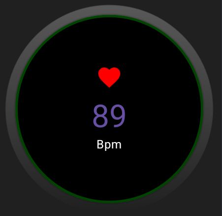
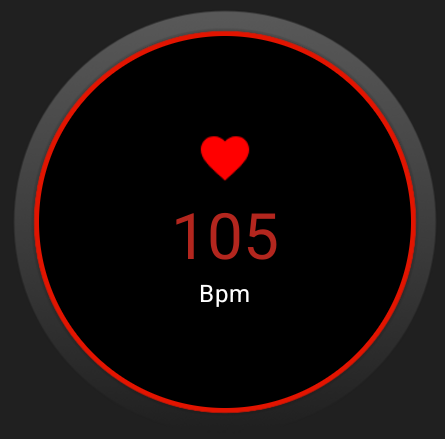
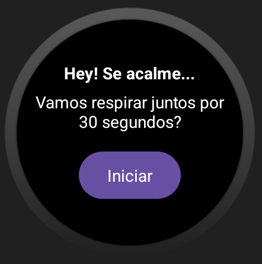
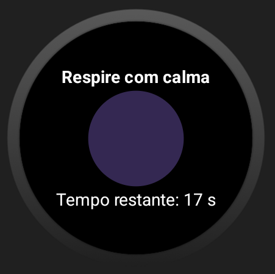
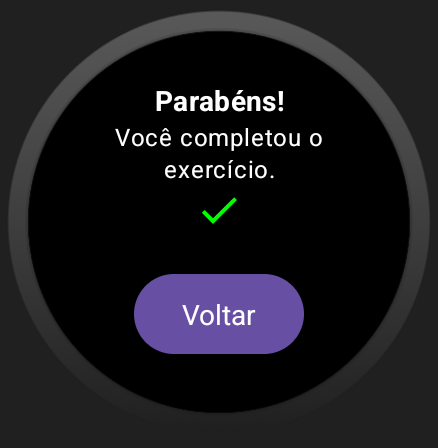

# ZenPulse
ZenPulse é um aplicativo desenvolvido para dispositivos Wear OS com foco em promover o bem-estar emocional e o controle da ansiedade.  
Ele monitora a frequência cardíaca do usuário em tempo real, identifica variações que indicam possíveis episódios de estresse e fornece um alerta visual em casos de batimentos elevados.  
Com uma interface minimalista e intuitiva, ele ajuda o usuário a perceber momentos de tensão e agir de forma preventiva, como iniciar uma respiração consciente.

## 📱 Funcionalidades
- Monitoramento contínuo da frequência cardíaca em tempo real.
- Detecção automática de batimentos elevados que podem indicar estresse ou ansiedade.
- Alerta visual discreto para promover a conscientização sobre o estado físico/emocional.
- Ícone de coração animado para reforçar a percepção do ritmo cardíaco.
- Interface circular e intuitiva, otimizada para dispositivos Wear OS.
- Suporte visual com cores e feedback tátil para estados de alerta.

## 🛠️ Tecnologias Utilizadas
- Kotlin com Jetpack Compose para Wear OS.
- Arquitetura MVVM com ViewModel.
- Componentes do Material 3 adaptados para dispositivos vestíveis.
- Animações com `animateFloatAsState` para o efeito de pulsação.
- Customização de UI com `drawBehind` e `CircleShape` para bordas circulares.

## 📸 Capturas de Tela
### Monitoramento Cardíaco – Normal
- Quando a frequência cardíaca está em níveis normais, a borda é exibida em verde e é apresentado o batimento atual.

### Monitoramento Cardíaco – Elevado
Após voltar do exercício de respiração, o app exibe a frequência cardíaca em vermelho (caso ainda estiver elevado), indicando que o usuário deve prestar atenção.

### Alerta de Estresse
O app detecta uma frequência elevada e sugere uma pausa para respiração consciente.

### Exercício de Respiração
O usuário é guiado por 30 segundos de respiração calma para reduzir os níveis de ansiedade.

### Feedback Positivo
Ao finalizar o exercício, o app parabeniza o usuário, reforçando o autocuidado.

